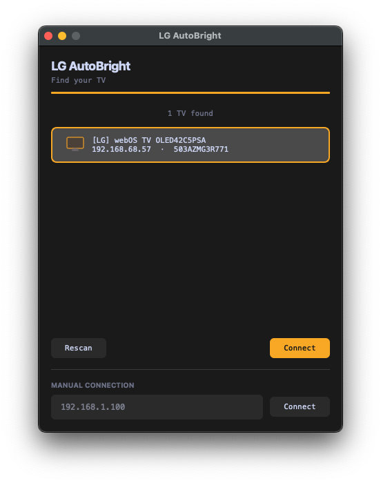
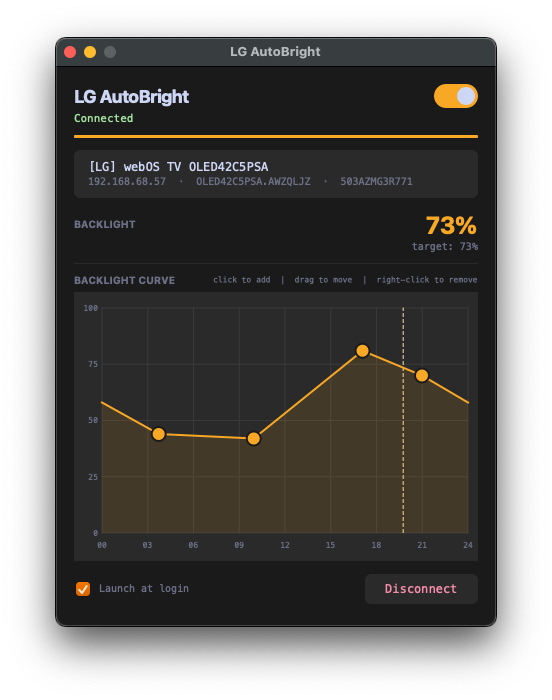

# LG AutoBright

Automatic backlight control for LG TVs on macOS. Discovers your TV on the local network, connects via WebOS, and adjusts the backlight throughout the day based on a custom curve you draw.

<p align="center">
  
  &nbsp;&nbsp;
  
</p>

## Features

- **Auto-discovery** of LG TVs on the local network via mDNS + AirPlay
- **Interactive curve editor** to set backlight levels across 24 hours
- **Live preview** while dragging nodes on the curve
- **System tray** icon with hide-to-tray on close
- **Launch at login** option via macOS LaunchAgent
- **Enable/disable toggle** to pause automatic adjustments

## Requirements

- macOS
- Python 3.10+
- An LG TV with WebOS on the same network

## Installation

```bash
git clone https://github.com/fredericocurti/lgtv-autobright.git
cd lgtv-autobright
python3 -m venv .venv
source .venv/bin/activate
pip install -e .
```

`bscpylgtv` must also be available to system Python for TV communication:

```bash
/usr/bin/python3 -m pip install --user bscpylgtv
```

> **Why system Python?** macOS restricts mDNS port binding and local network websocket access to binaries with Apple entitlements. Homebrew/venv Python doesn't have these, so discovery and TV commands are run via `/usr/bin/python3` automatically.

## Usage

```bash
source .venv/bin/activate
lgtv-autobright
```

On first launch, the app scans for LG TVs on your network. Select your TV or enter its IP manually. The TV will show a pairing prompt on first connection.

### Backlight Curve

The curve editor lets you define backlight levels (0-100) throughout the day:

- **Click** on the chart to add a node
- **Drag** a node to adjust time and brightness
- **Right-click** a node to remove it

The curve wraps around midnight and updates are sent to the TV every 5 minutes. Changes are saved automatically as you edit.

## Architecture

```
lgtv_autobright/
  app.py          PyQt6 main window, system tray, curve chart
  brightness.py   Curve interpolation, scheduler, config
  tv.py           TV connection via system Python subprocess
  discovery.py    mDNS + AirPlay TV discovery (self-contained)
```

## Config

Settings are stored at `~/.config/lgtv-autobright/config.json`. The WebOS pairing key is stored in `.aiopylgtv.sqlite` in the working directory.

## License

MIT
